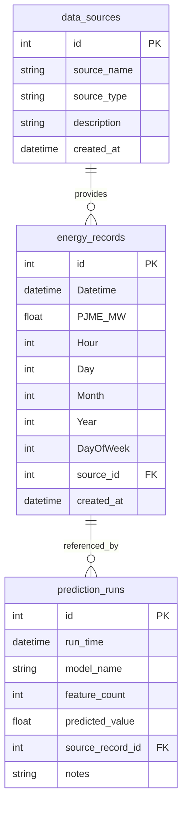

# Database Design (Task 2 and Task 3)

## Relational Schema (MySQL)

Tables implemented:

- `data_sources`
- `energy_records`
- `prediction_runs`

### ERD



### SQL Schema Script

- See `database/schema.sql`

### SQL Queries and Example Results

1. Latest record

```sql
SELECT id, Datetime, PJME_MW FROM energy_records ORDER BY Datetime DESC, id DESC LIMIT 1;
```

Example result:

```text
id=782, Datetime=2026-07-02 10:00:00, PJME_MW=30654.23
```

2. Date range query

```sql
SELECT COUNT(*) AS cnt FROM energy_records
WHERE Datetime BETWEEN '2026-06-01 00:00:00' AND '2026-06-07 23:00:00';
```

Example result:

```text
cnt=168
```

3. Monthly aggregate

```sql
SELECT Month, ROUND(AVG(PJME_MW),2) AS avg_mw
FROM energy_records
GROUP BY Month
ORDER BY Month;
```

Example result:

```text
Month=1 avg_mw=32110.44
Month=2 avg_mw=30988.12
...
```

## MongoDB Collection Design

Database: `energy_db`
Collection: `energy_records`

Document shape:

- `_id` (ObjectId)
- `datetime` (ISODate)
- `pjme_mw` (double)
- `hour` (int)
- `day` (int)
- `month` (int)
- `year` (int)
- `dayofweek` (int)
- `source` (string)
- `created_at` (ISODate)

### Sample Document

```json
{
  "_id": "6683f1d6e2e4ab11a0f8a001",
  "datetime": "2026-07-02T10:00:00Z",
  "pjme_mw": 30654.23,
  "hour": 10,
  "day": 2,
  "month": 7,
  "year": 2026,
  "dayofweek": 3,
  "source": "prediction_api",
  "created_at": "2026-07-02T10:00:01Z"
}
```

### MongoDB Queries and Example Results

1. Latest record

```javascript
db.energy_records.find().sort({ datetime: -1, _id: -1 }).limit(1);
```

Example result:

```text
{ datetime: ISODate("2026-07-02T10:00:00Z"), pjme_mw: 30654.23, ... }
```

2. Date range query

```javascript
db.energy_records
  .find({
    datetime: {
      $gte: ISODate("2026-06-01T00:00:00Z"),
      $lte: ISODate("2026-06-07T23:00:00Z"),
    },
  })
  .count();
```

Example result:

```text
168
```

3. Average by month

```javascript
db.energy_records.aggregate([
  { $group: { _id: "$month", avg_mw: { $avg: "$pjme_mw" } } },
  { $sort: { _id: 1 } },
]);
```

Example result:

```text
{ _id: 1, avg_mw: 32110.44 }
{ _id: 2, avg_mw: 30988.12 }
```

## Endpoints (Task 3)

SQL CRUD + queries:

- `POST /sql/records`
- `GET /records/latest`
- `GET /records?start_datetime=...&end_datetime=...`
- `GET /records/{record_id}`
- `PUT /records/{record_id}`
- `DELETE /records/{record_id}`

Mongo CRUD + queries:

- `POST /mongo/records`
- `GET /mongo/records/latest`
- `GET /mongo/records?start_datetime=...&end_datetime=...`
- `GET /mongo/records/{record_id}`
- `PUT /mongo/records/{record_id}`
- `DELETE /mongo/records/{record_id}`

Dual-write endpoint:

- `POST /records` writes to both SQL and MongoDB.
