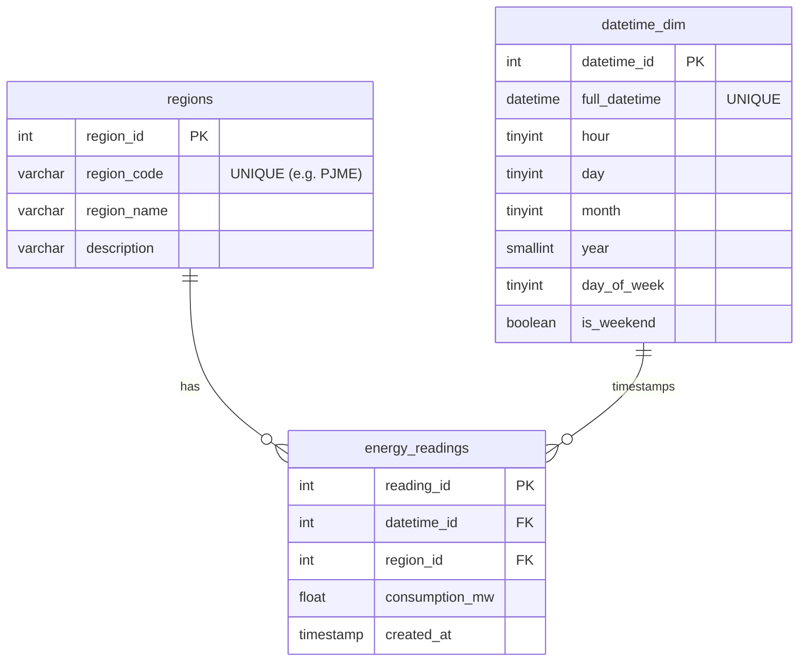

# ERD — Relational schema (star schema)

GitHub renders the Mermaid diagram below directly. A rendered `erd_diagram.png`
is also included for pasting into the PDF report.

**Relationships**

- `regions (1) —— (many) energy_readings` — one region has many hourly readings.
- `datetime_dim (1) —— (many) energy_readings` — one timestamp has one reading
  per region (enforced by the `UNIQUE (datetime_id, region_id)` key on the fact table).
- `energy_readings` is the **fact table**; `regions` and `datetime_dim` are the
  **dimension tables**. This star layout keeps measurements small and lets us
  filter/aggregate by any calendar attribute without re-parsing timestamps.
